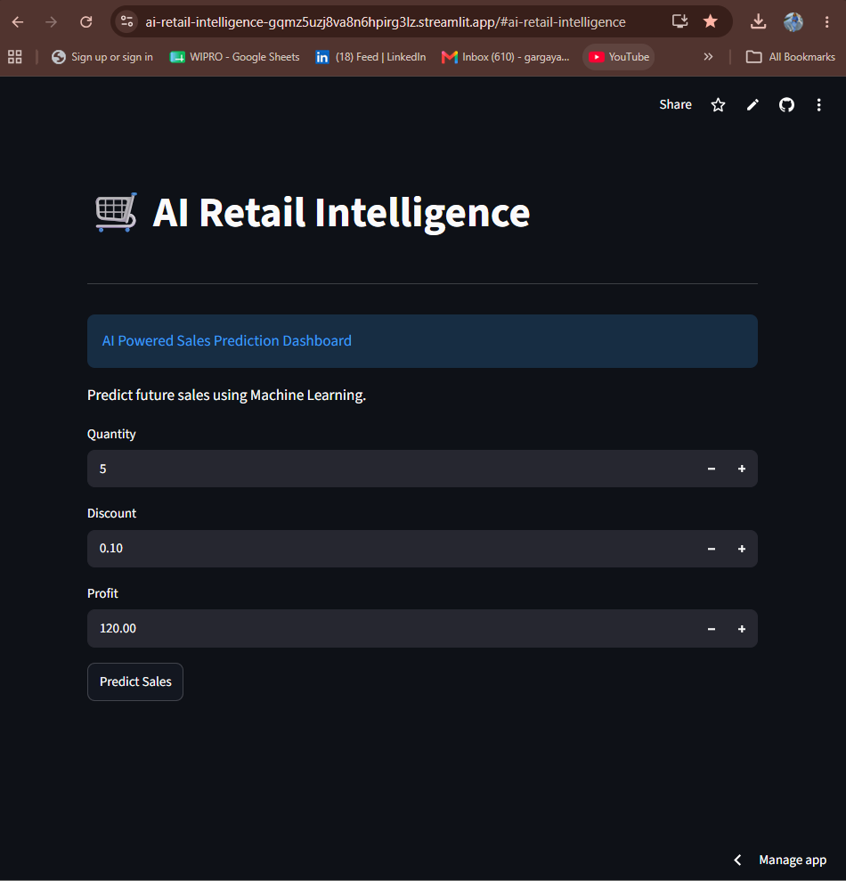
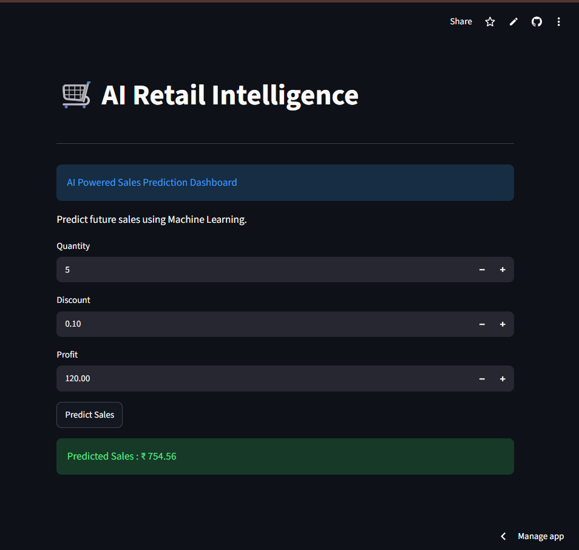

# 🛍️ AI Retail Intelligence Platform

## Live Demo
https://ai-retail-intelligence-gqmz5uzj8va8n6hpirg3lz.streamlit.app/

## 📌 Overview
An AI-powered Retail Analytics Platform built using Python.

## Application Preview

### Home

---

### Prediction

---

### Dashboard

## 🚀 Features
- Sales Analysis
- Customer Analysis
- Data Visualization
- Sales Forecasting (Coming Soon)
- Customer Segmentation (Coming Soon)

## 🛠 Tech Stack
- Python
- Pandas
- Matplotlib
- Plotly
- Scikit-learn

## 📂 Project Structure

AI-Retail-Intelligence/
├── dataset/
├── src/
├── models/
├── reports/
├── README.md

## 👩‍💻 Author

Nandita Gargayan